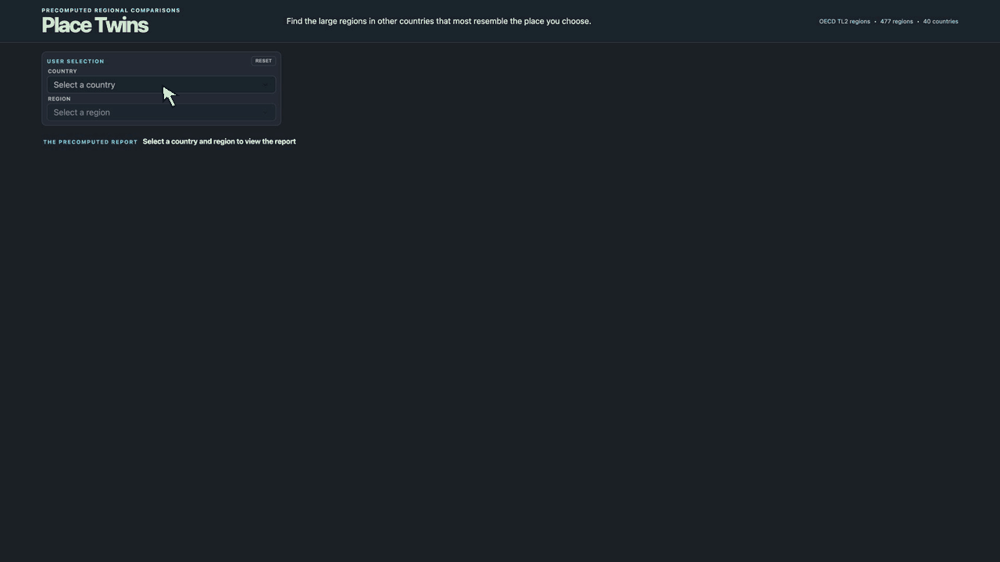

# Dash Precompute

People notice when a dashboard takes one to ten seconds after every click. When the set of valid choices is bounded, I would rather calculate the expensive analytical results ahead of time and make the interaction immediate.

This repository is my reference implementation of that pattern in Dash. A pre-build step checks the source data, calculates every valid result, and stores the results in a small indexed set of files. At interaction time, the callback retrieves one result and constructs live Plotly figures. The same structure works for one chart or for a coordinated report.

Place Twins is the worked example. It combines several public datasets to compare large OECD regions across countries. A selection updates eight views at once, making the benefit of precomputing easy to see.

Try the [live Place Twins demonstration](https://place-twins-n265elrn2q-ue.a.run.app/).

The current build contains 477 precomputed regional reports in 2.36 MiB. After the application has started, retrieving one report takes less than a millisecond. The local benchmark reconstructs all eight figures in a median 84 ms and prepares the 187 KiB response in another 6 ms. Together, the work performed after a selection takes about 91 ms before network transfer and browser rendering.

The live demonstration runs on a small Cloud Run instance with 1 vCPU and 1 GiB of memory. From the US East Coast, the first full report on a warm instance reached the browser in about 1.2 seconds plus rendering; later reports arrived in about 0.5 to 0.6 seconds plus rendering. Starting from zero takes roughly 5 to 10 seconds once. An abandoned browser tab does not send recurring requests that keep the instance running.



*Each selection retrieves a saved report; the returned charts remain live Plotly figures.*

## How it works

This approach fits a finite set of choices and source data that can be refreshed in batches, but not open-ended requests or results that must reflect continuously changing data.

### Pre-build

1. Decide which selections the app will allow and how their results will be calculated.
2. Check the source data and calculate one report for each selection.
3. Save the reports as compressed files.
4. Write an index that lists the available choices and where each report is stored.
5. Once every report is ready, mark the completed set as current.

```text
source tables -> calculate every report -> saved report set -> current.json
```

A completed set of reports remains tied to its source data and matching settings, so running the build again uses the existing set whenever neither has changed.

### Interaction time

1. Read the index when the app starts without opening every saved report.
2. Use the index to fill the country and region controls.
3. Match the user's selection to one report.
4. Check and load that report.
5. Construct the live Plotly figures from the saved data.

```text
user selection -> report index -> one saved report -> live Plotly figures
```

Because the callbacks do not download source data or recalculate the regional comparisons, they can reconstruct live charts from the saved numbers while retaining hover behavior, resizing, and full-screen inspection.

### What gets saved

```text
artifacts/
    current.json
    bundles/<version>/
        manifest.json
        payloads/<report-file>.json.gz
```

The report index is saved as `manifest.json`. It lists every available country and region and points to the corresponding saved report. The measures, transformations, weights, and cross-country restriction are fixed when the set is created, so there is one report for each region. Data used by every report are stored once in a shared file rather than repeated hundreds of times. At runtime, `ArtifactCatalog` uses `current.json` to find the active set, confirms that a requested file is in the correct folder and has not changed, and opens only that report.

## The Place Twins example

Place Twins compares 477 OECD large regions in 40 countries using population, population density, population change from 2018 to 2023, and GDP per person adjusted for differences in purchasing power. Before matching, the measures are put on comparable scales, and population, density, and GDP per person are adjusted so that unusually high values do not dominate. Each measure receives equal weight, and every suggested counterpart must come from another country.

The 0 to 100 similarity score summarizes how close two regions are under this calculation. It is not a probability or a claim that the regions are equivalent. OECD TL2 regions are useful for international comparison, but they are administrative areas defined differently from one country to another.

One selection produces a choropleth of each country's best counterpart, a regional landscape, four metric distributions, actual population paths, a ranked counterpart view, a multi-region real-income dumbbell, age-composition bars, and population-weighted local-density curves. Several views draw from different source tables because their units of observation better support the visual form. The page begins with an empty selection rather than a hidden default report. The dense overview keeps all eight figures visible on a 1080p display, and each figure can expand to fill the screen with its text, annotations, markers, and line widths scaled accordingly.

## Where to look in the code

- [`precompute.py`](src/dash_precompute/precompute.py) checks the source tables, calculates every comparison, and saves the reports. A new set does not become current until every file is ready.
- [`catalog.py`](src/dash_precompute/catalog.py) finds the saved report for a selection and verifies the file before opening it.
- [`layout.py`](src/dash_precompute/layout.py) and [`app.py`](src/dash_precompute/app.py) build the controls from the report index. The callback handles the selection, retrieves one report, and reconstructs the page.
- [`figures.py`](src/dash_precompute/figures.py) contains `build_report_figures`, the same function used by the callback and benchmark. [`visual_policy.py`](src/dash_precompute/visual_policy.py) contains the Plotly styling used by this example.
- [`place_twins.css`](src/dash_precompute/assets/place_twins.css) and [`expand_charts.js`](src/dash_precompute/assets/expand_charts.js) create the compact report grid and expanded chart view.
- [`reload_on_version.js`](src/dash_precompute/assets/reload_on_version.js) checks for a new application version when someone returns to an open tab. It does not poll the server and keep an unused Cloud Run instance awake.

Instructions for local setup, building reports, verification, and containers are kept in [`DEVELOPMENT.md`](DEVELOPMENT.md).

## Sources

- OECD (2026), [*Regions, Cities and Local Areas database*](https://data-explorer.oecd.org/), accessed August 2026 ([suggested citation](http://oe.cd/geostats); [terms and conditions](https://www.oecd.org/en/about/terms-conditions.html)).
- Schiavina et al. (2026), *[GHS-WUP-POP R2025A](https://data.jrc.ec.europa.eu/dataset/adba95af-db56-4569-acd3-9513201eba30)*, European Commission, Joint Research Centre, [doi:10.2905/adba95af-db56-4569-acd3-9513201eba30](https://doi.org/10.2905/adba95af-db56-4569-acd3-9513201eba30), accessed August 2026.
- Natural Earth Admin 0 boundaries, accessed August 2026 and published under Natural Earth's [public-domain terms](https://www.naturalearthdata.com/about/terms-of-use/).

The MIT license covers the code only, and the repository does not distribute the prepared tables or generated reports through Git.
